# A REST API With Node, Express, TypeScript & MongoDB + Authentication

This project demonstrates a **RESTful API** built with **Node.js**, **Express**, **TypeScript**, and **MongoDB**, featuring user authentication and CRUD operations.
It was developed to practice backend architecture, authentication flows, database integration, and API testing using **Restfox**.

---

## 🚀 Features

* Built with **Node.js** and **Express**
* Written in **TypeScript**
* Database: **MongoDB**
* Authentication (login & register endpoints)
* CRUD operations for data management
* API testing with **Restfox**

## 📌 Overview

The API allows users to:

* Register and log in securely with JWT authentication
* Perform CRUD operations on stored data
* Connect to a **MongoDB** database
* Test endpoints easily using Restfox

---

## ⚙️ Project Setup

```bash
git clone https://github.com/username/repository-name.git
cd repository-name
npm install
npm run dev
```

Server runs at:
`http://localhost:8000`

---

## 📂 Project Structure

```
src/
 ┣ controllers/   → Business logic for routes
 ┣ middleware/    → Authentication & validation
 ┣ models/        → Mongoose schemas
 ┣ routes/        → API endpoints
 ┗ server.ts      → Main application entry
```

---

## 🔑 Authentication Flow

1. **Register** → Create a new user with encrypted password.
2. **Login** → Authenticate and receive a token.
3. **Use Token** → Access protected routes (CRUD operations).

---

## 📸 Project in Action

### 1. Register a New User with Restfox

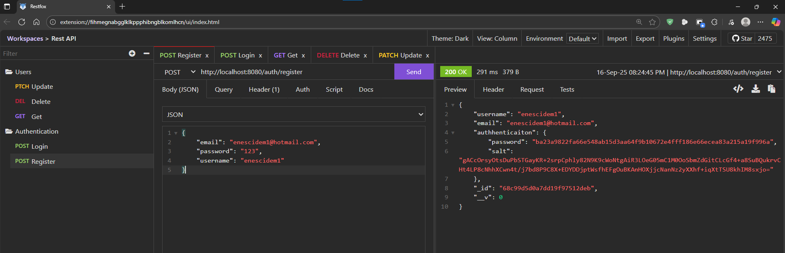

### 2. User Saved in MongoDB

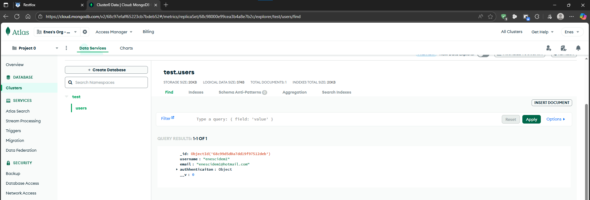

### 3. Wrong Login Attempt

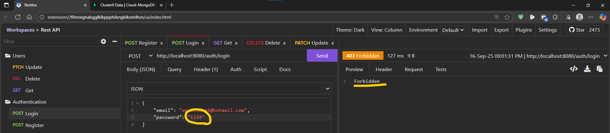

### 4. Correct Login – Token Returned

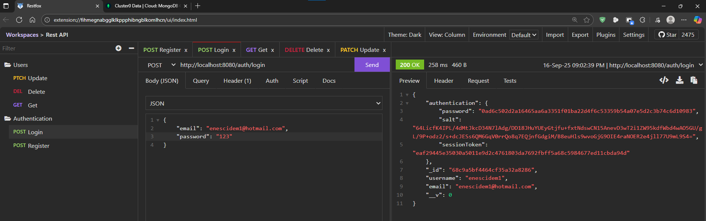

### 5. Login with Cookies Stored

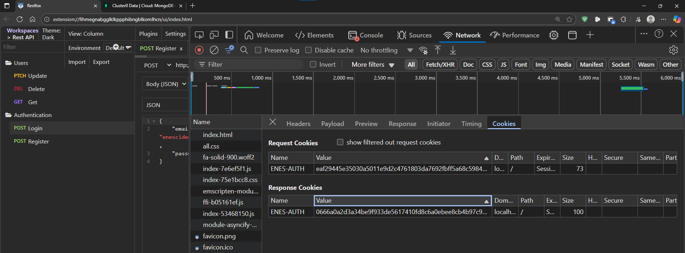

### 6. Get All Users (Authorized Request)

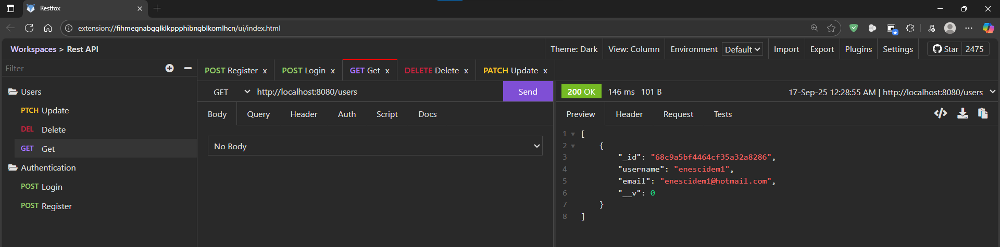

### 7. Register Another User via Restfox

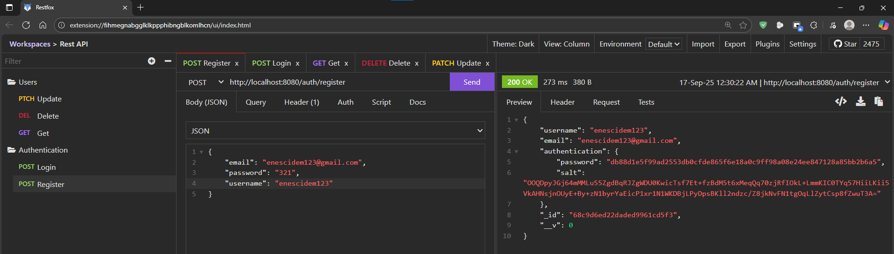

### 8. Verify Second User in MongoDB

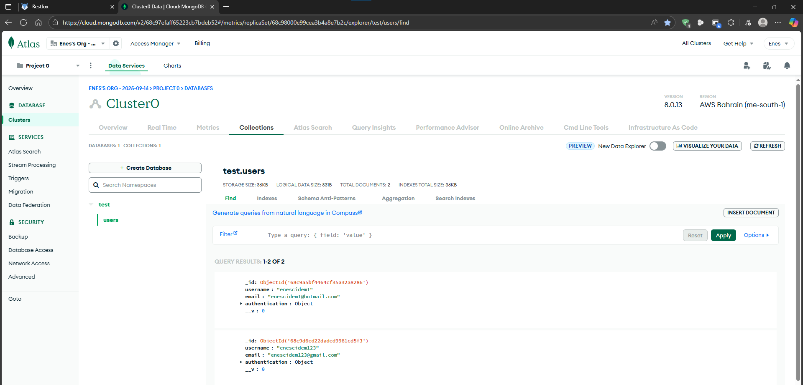

### 9. Fetch Users Again

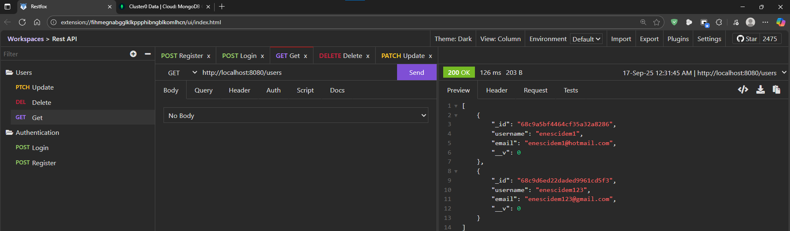

### 10. Delete a User – Restfox

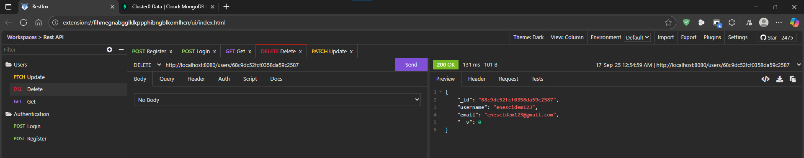

### 11. Verify User Deleted – MongoDB

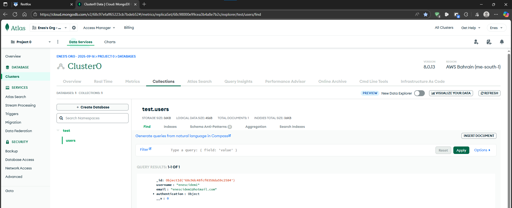

### 12. Fetch Users After Deletion

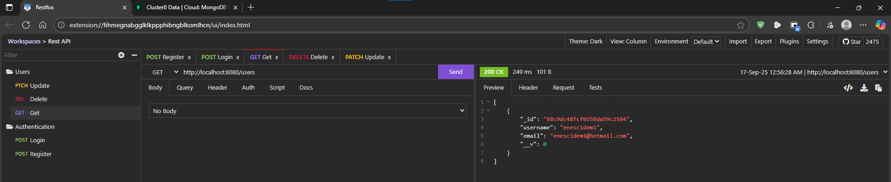

### 13. Register One More User

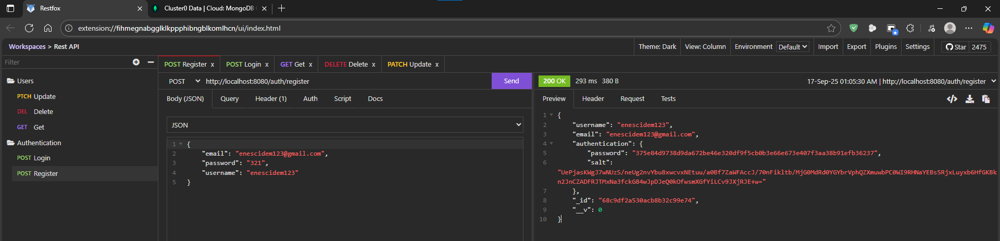

### 14. Get Users – Restfox

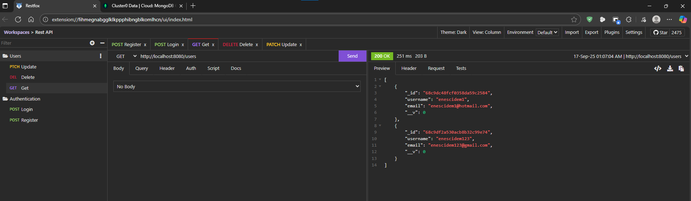

### 15. Try Deleting Without Login (Unauthorized)

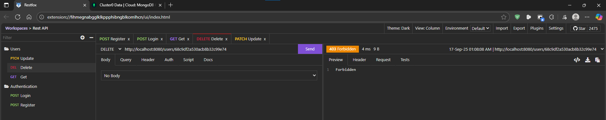

### 16. Login Again

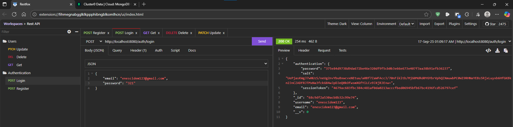

### 17. Delete User With Login (Authorized)

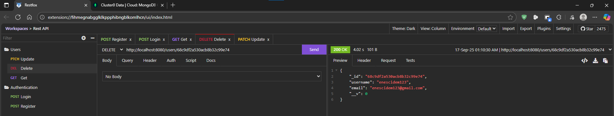

### 18. Update User Information

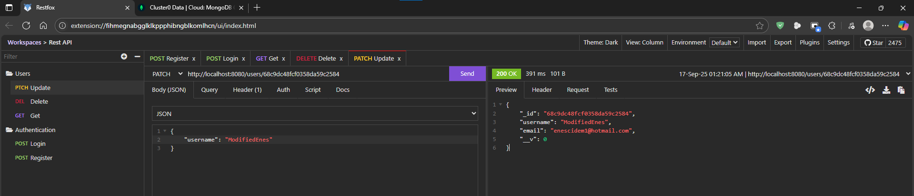

### 19. Verify Updated Data in MongoDB

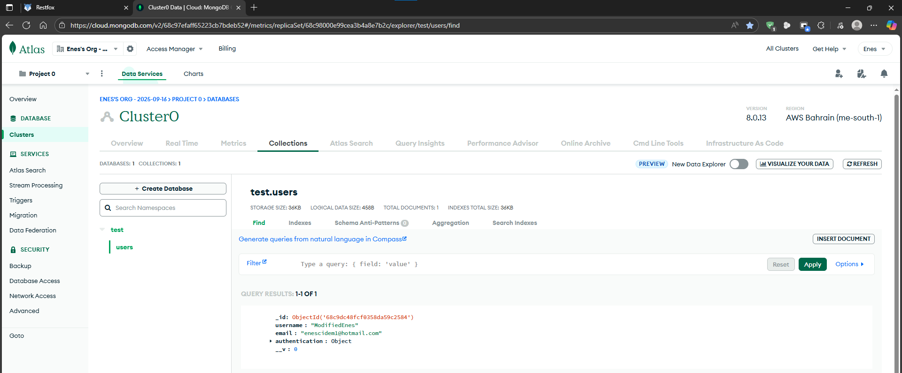

---

## 🛠️ Technologies Used

* **Node.js** & **Express**
* **TypeScript**
* **MongoDB** & **Mongoose**
* **JWT Authentication**
* **Restfox**

---

## 📌 Conclusion

This project shows how to build a **secure REST API** with authentication, database operations, and clean TypeScript code.
The screenshots illustrate the full flow — from registration to login, CRUD operations, and database verification.

It can be extended with:

* Role-based authorization
* Advanced input validation
* Deployment on platforms like AWS, Render, or Docker
